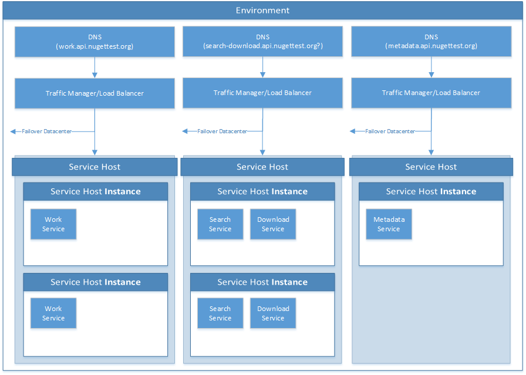

# NuGet Service Model
APIv3 is built on a foundation of "microservices". In order to make it easy to build and run these microservices, we have constructed a simple model for designing and implementing these services.

## Goals
1. Modular - It should be simple to update and deploy individual services
2. Reliable - Able to support a highly-available failover architecture
3. Selfhostable - One-box hostable (perhaps with limited functionality, but hopefully limited ONLY by performance and other shared hosting issues)

## Physical Architecture

### Application
A NuGet Application is a complete set of Environments making up a single application for viewing/uploading/downloading/searching NuGet Packages. For example, "NuGet.org" is an Application (the name here does **not** indicate a DNS name, it just happens to match one :)). Another Application could be "Chocolatey.org", etc. 

An Application in the NuGet Services model is given a simple name with no hyphens (-) or underscores (_), such as "nuget".

### Environment
An Application is made up of one or more Environments. Each Environment represents a single entry point DNS name for all services within that Environment. For example "api.nuget.org" is the entry point for the "Production" Environment of the "NuGet.org" Application. Generally, each Environment is given a unique DNS root (for example: "nuget.org").

An Environment is given a composite name consisting of the name of the Application, followed by a hyphen (-), followed by the Environment name (which cannot contain hyphens or underscores), for example "nuget-int".

### Datacenter
A Datacenter is a **logical** concept that **may or may not** (but generally will) map to a physical datacenter containing servers and services. There is one Primary Datacenter, labeled "Datacenter 0" and zero or more Secondary Datacenters, labelled "Datacenter 1" and up. Only the Primary Datacenter supports write operations in the current model (though this may change). The Secondary Datacenters are for disaster recovery and _possibly_ for improving latency in different geographical regions.

A Datacenter is given a composite name by appending the index number of the Datacenter to the Environment name: "nuget-int-0"

### Service Host
A Service Host represents a single DNS endpoint on the primary Domain Name used by the Environment. That DNS endpoint may point to a load balancer or to a single service, depending on the deployment model being used. In the case of a load-balanced farm of servers, each server is referred to as a "Service Host Instance" and runs the **same code and configuration** as each other server in the Service Host. In Azure, a Service Host maps to a Cloud Service **Role**.

The Service Host also provides an HTTP Server (using Owin) that responds to a simple GET request to the root URL for the Host and lists the Services available in that Host.

A Service Host is given a name that describes the services that exist in the host, which is appended to the Datacenter name: "nuget-int-0-work". In the case of multiple load-balanced servers within a host, each machine is further identified by a 0-based index: "nuget-int-0-work_IN0"

### Service
A Service is a single package of code that makes up a single microservice in the NuGet Service Model. Services may be hosted in dedicated Hosts (each Host having one and only one service) or in shared Hosts (to facilitate one-box deployments). Each service provides an Owin Application that attaches to a single URL root on the Service Host (for example "/work"). The Service Host will list the service in it's root document and dispatch requests for URLs under that root to the Service.

A Service is given a name that describes it's purpose, which is appended to the Service Host name: "nuget-int-0-work_IN0-work"

## Architecture Diagram
Below is a rough diagram of the Physical Architecture breakdown

