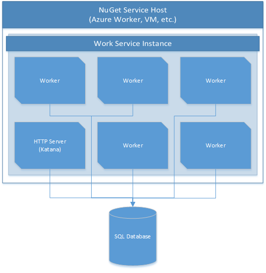

# The Work Service
The Work service is a simple queue-driven processing service. The service uses a queue implemented on a SQL Database (see below for why we chose SQL) that supports guaranteed delivery and optimistic concurrency. Each worker in the service takes work items from the queue, executes the job specified by the queue message with the payload included, and reports the status of that invocation back to the queue.

## Sections
1. Architecture (below)
2. [API](API.md)
3. [Management Commands](NuCmd.md)
4. [Monitoring and Testing](Testing.md)

## Architecture
The Work service consists of the following elements:
1. The Work Service (see the [Service Model](../README.md) documentation for more information)
2. A collection of Workers, hosted within each Work Service
3. A SQL Database holding the work queue
4. An HTTP endpoint for managing the work queue

Below is a simple architecture diagram:

### Why SQL?
We used SQL primarily because we wanted to be able to query the status of the queue in many different ways. We originally intended to use Azure Queues, but found a few issues with that implementation. First, Azure Queues allow you to hide messages in order to implement it's guaranteed delivery model as well as providing a simple scheduling mechanism. Unfortunately, once a message is hidden, it is invisible to the entire system, even to management tools. This makes it difficult to track the progress of a message in the queue. Similarly, we found that we would want to know the state of the work queue from various different angles. For example, we might want to know how many jobs failed in a time window, or what the status of the latest invocation of a particular job is. In the end, SQL gave us the most flexibility and since this is a relatively low-traffic database, SQL seemed like an acceptable choice.

## Concepts

### Jobs
A Job is single type of work that can be run by the worker. Each Job is represented by a class inheriting from NuGet.Services.Work.JobHandlerBase. When an invocation is processed, the Job class will be constructed and the Invoke method will be called.

### Invocation
An invocation is a single request to invoke a Job at a given time. The invocation specifies the Job to be invoked, the Payload to provide it (in the form of a dictionary of string keys and string values), the Source of the invocation and some metadata indicating when the invocation was created and when it transitioned between states.

### Worker
A Worker is a single thread of execution within the Work Service. Each Operating System Process running the work service will likely have multiple Worker threads running.

### Work Service
The Work Service is a NuGet Service (as defined in the [Service Model](../README.md)). There can only be one Work Service in a single Operating System Process.

### Invocation States
An invocation can be in one of the following States:
* **Queued** - The invocation has been inserted in to the queue
* **Dequeued** - The invocation has been claimed by a Worker
* **Executing** - The invocation is being executed by a Worker
* **Executed** - The invocation has finished executing. It may not have succeeded, but it will not be executed again
* **Cancelled** - The invocation was cancelled by an outside agent, Workers will not attempt to claim it.
* **Suspended** - The invocation is waiting for an external service and has suspended itself until that service responds

Below is a diagram of the states and the transitions between states:

### Dequeuing
An invocation in the **Queued** or **Suspended** state may be eligible for dequeuing by a Worker. The NextVisibleAt date/time field indicates when the message may be dequeued. Dequeuing the message simply updates the DequeueCount for the invocation and sets the NextVisibleAt time to a later point (generally 5 minutes from the dequeue time). If the Worker crashes, or otherwise fails to extend the NextVisibleAt time or complete the job, the invocation will become eligible for dequeuing again.

The queue is **NOT** guaranteed to be a strict FIFO (first-in-first-out) queue. Messages may be dequeued in a different order if they are queued within the same second.

### Invocation Suspension
An invocation can be suspended by inheriting from the NuGet.Services.Work.AsyncJobHandlerBase class and using the Suspend helper. When an invocation is suspended, the Job is expected to provide enough state (in the call to Suspend) to allow a completely different Worker to pick it up and continue execution. So, any parameters provided in the Payload should be provided, along with any data calculated during the last execution. Once suspended, the invocation is placed back on the Queue with the new Payload and will become eligible for dequeuing by another Worker later.

For an example, check out the NuGet.Services.Work.Jobs.CreateOnlineDatabaseBackupJob class in the NuGet.Services.Work project.

### Singleton Jobs
TODO

## Invocation Workflow
When an invocation is dequeued by the worker, the job referenced in the invocation is invoked and provided the payload specified in the invocation. If the job completes execution (by throwing an exeception or completing successfully) the Invocation is considered Executed and will not be requeued. If the job suspends execution, the Invocation is considered Suspended and will be dequeued again at a later point. If the
job does not complete or suspend before the NextVisibleAt time elapses, the Invocation will become visible again and other Workers may dequeue it. The Invocation also has a version number attached to it that must be provided along with all database invocations. If the version number is not the same as the current highest version number, the request is refused. This way, if a Worker hangs and another picks up an invocation that was in progress, the first Worker can no longer affect that Invocation record because it's version is out of date